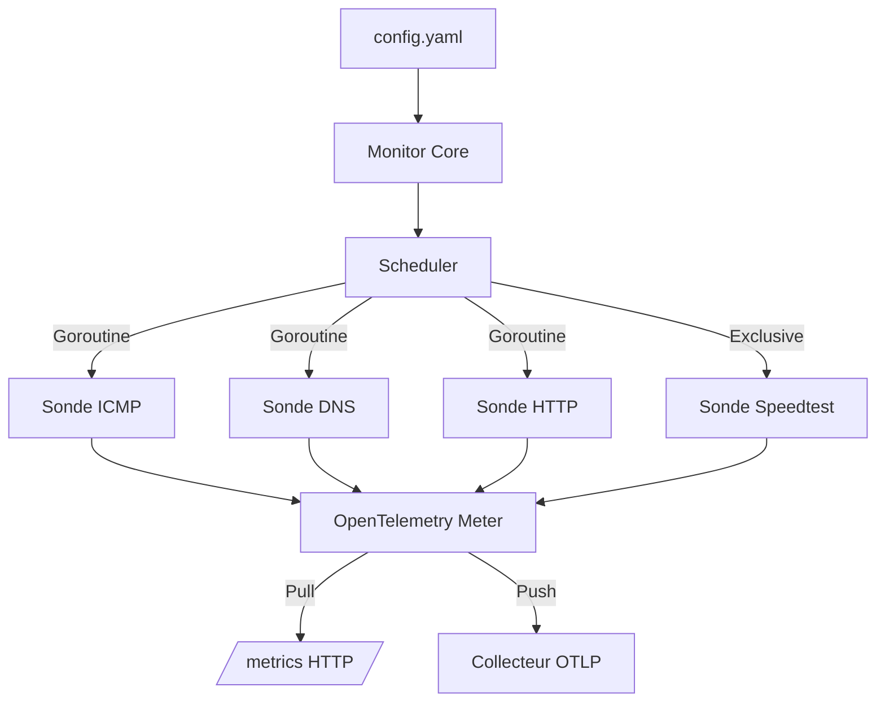
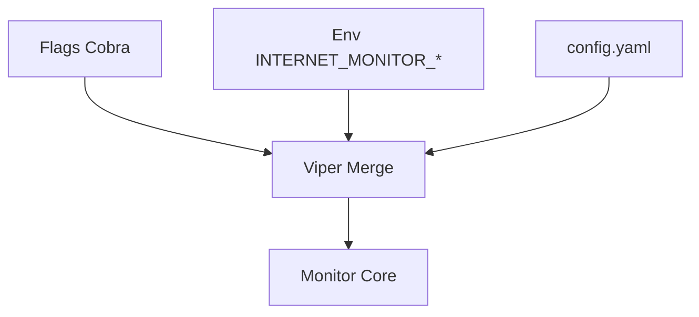

# Design Architecture - Internet-Monitor

## 1. Architecture Globale
L'application suit un modèle de découplage strict entre le moteur de mesure (Monitor Core), l'orchestrateur (Scheduler) et le pipeline d'export (OTLP).

## 2. Couche CLI et Configuration

L'entrée de l'application est gérée par `spf13/cobra` (structure de commandes) couplé à `spf13/viper` (chargement et fusion de la configuration).

* **`cobra`** définit la commande racine (et les sous-commandes futures, ex: `internet-monitor run`, `internet-monitor version`) ainsi que les flags globaux (`--config`, `--log-level`, `--otlp-endpoint`, `--metrics-addr`).
* **`viper`** charge le fichier `config.yaml` (cibles + sondes, cf. FR1) et fusionne par-dessus les réglages **opérationnels** uniquement, dans l'ordre de priorité standard Viper : flag CLI > variable d'environnement > fichier YAML > valeur par défaut.
* **Variables d'environnement :** liaison automatique via `viper.SetEnvPrefix("INTERNET_MONITOR")` + `viper.AutomaticEnv()`, avec remplacement `.`/`-` par `_` (`viper.SetEnvKeyReplacer`). Exemples : `INTERNET_MONITOR_LOG_LEVEL`, `INTERNET_MONITOR_OTLP_ENDPOINT`, `INTERNET_MONITOR_METRICS_ADDR`.
* **Frontière stricte avec FR1 :** la liste des `targets` et des sondes associées (adresses, types de sondes, intervalles) reste exclusivement définie dans `config.yaml` et chargée en tant que structure imbriquée par Viper — elle n'est **jamais** exposée via un flag Cobra individuel ni une variable d'environnement. Seuls les réglages opérationnels globaux de l'agent (niveau de log, endpoints d'export, adresse d'écoute `/metrics`, chemin du fichier de config) sont éligibles à la surcharge par flag/env.

## 3. Modèle de Concurrence et Ordonnancement

Pour répondre à l'exigence **FR4** (suspension pendant le Speedtest), le système utilise le modèle de communication par Channels de Go.

* **Worker Interface :** Chaque sonde implémente une interface standard avec un `Start()`, un canal de commandes (`CmdChan <-chan Command`) et un canal d'acquittement (`AckChan chan<- struct{}`).
* **Boucle de contrôle (Select) :** Dans sa goroutine, la sonde utilise un `select` pour écouter soit son `ticker` (pour déclencher une mesure), soit le `CmdChan`.
* **Mécanisme de Pause :**
1. Le Scheduler envoie `CmdPause` sur les `CmdChan` de toutes les sondes.
2. Les sondes terminent leur requête en cours (pas d'interruption abrupte).
3. Les sondes envoient un signal sur `AckChan` et entrent dans une boucle bloquante d'attente.
4. Le Scheduler, ayant reçu tous les ACKs, lance le Speedtest.
5. À la fin, le Scheduler envoie `CmdResume`.

## 4. Modèle de Télémétrie (OpenTelemetry)

Les métriques sont instrumentées une seule fois via `go.opentelemetry.io/otel/metric`.

**Conventions de nommage (Prefix: `internet_monitor_`) :**

* `internet_monitor_rtt_seconds` (Float64Histogram, Native) : Latence globale.
* `internet_monitor_jitter_seconds` (Float64Histogram, Native) : Variation de latence.
* `internet_monitor_packet_loss_ratio` (Float64Gauge) : Pourcentage de perte.
* `internet_monitor_speedtest_bytes_per_second` (Float64Gauge) : Bande passante.

**Labels standards associés à chaque métrique :**

* `target` : ex. "google" ou "1.1.1.1"
* `probe` : ex. "icmp", "dns"
* `ip_version` : "ipv4" ou "ipv6"

## 5. Stratégie de Diagnostic

La logique de corrélation est effectuée localement. Si la sonde MTR détecte une perte de paquet sur le saut N, et que la sonde ICMP vers la cible finale détecte une perte équivalente, un log structuré (JSON) est émis avec le niveau `WARN` détaillant le point de rupture probable (ex: "Dégradation identifiée au niveau du routeur local" ou "Dégradation au niveau du transit ISP").
